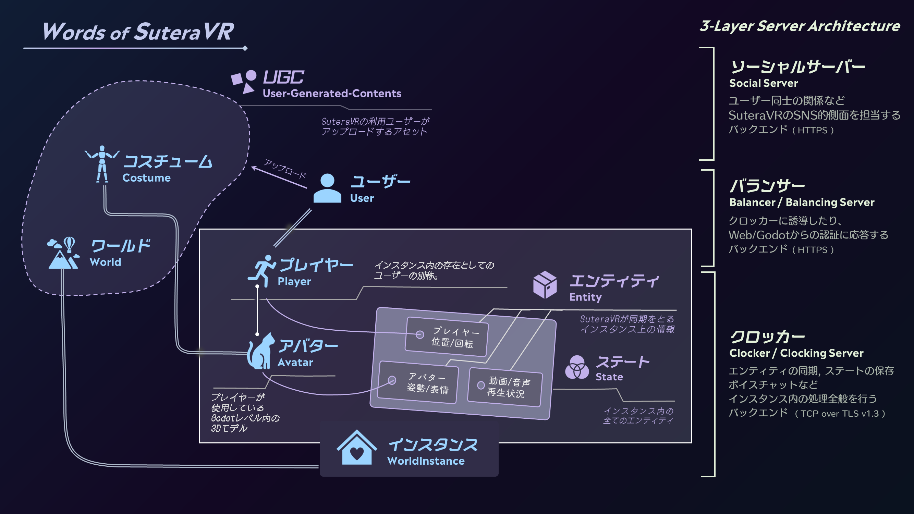

# SuteraVRのアーキテクチャ

SuteraVRは

## ソーシャルサーバー
ユーザー同士の関係などSuteraVRのSNS的側面を担当するバックエンド(HTTP)

## バランサー
[クロッカー](#クロッカー)に接続したり、Web/Godotからの認証に対応するバックエンド(HTTP)

## クロッカー
[エンティティ](./glossary.ja.md#エンティティ)の同期、[ステート](./glossary.ja.md#ステート)の保存、ボイスチャットなど[インスタンス](./glossary.ja.md#インスタンス)内の処理全般を行うバックエンド(TCP over TLS v1.3)
